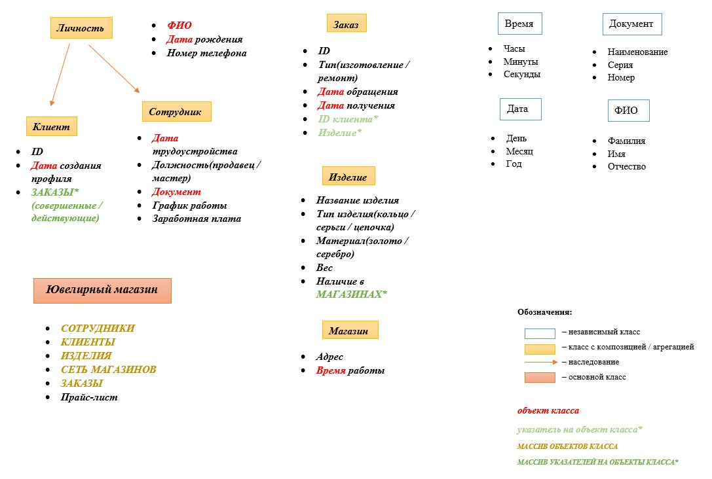

# Проект с индивидуальной предметной областью

**Выбранная предметная область:** ЮВЕЛИРНЫЙ МАГАЗИН

**Цель работы:** реализовать программное обеспечение для мониторинга и управления данными ювелирного магазина, включая учёт изделий, клиентов и сотрудников.

## Задачи проекта:
1.	Реализовать программное обеспечение для учета клиентов, сотрудников, изделий.
2.	Приложение должно обеспечивать возможность продавцу быстро и легко выполнять свои функции:
*	собирать данные о клиентах и их заказах,
*	вести учёт товаров,
*	отслеживать готовность заказов клиентов,
*	обновлять информацию о наличии товаров в сети магазинов,
*	уведомлять мастера о новых поступлениях заказов и ремонтов.
3.	Обеспечить возможность генерации отчётов по продажам, клиентам и товарам.

## Функциональные требования:
Приложение реализуется в виде windows-приложения с удобным навигационным меню, качественным отображением информации и простыми формами для заполнения данных.

*Основные возможности, которые будут предусмотрены приложением:*
1.	Приложение реализуется с авторизацией по логину/паролю.
2.	Основной режим работы приложения упрощает работу продавца, предоставляет все необходимые ему функции, однако ограничивает доступ к информации о сотрудниках.
3.	Доступ к особому режиму создания/изменения сотрудников, назначения им окладов, мониторингу их работы будет осуществляться по особому логину/паролю, которые будут выданы директору.
4.	Все данные будут храниться в csv-формате и подтягиваться при очередном запуске приложения. 
5.	При запуске приложения будет проводиться автоматическая проверка и удаление устаревших записей (например, неактуальных клиентов).
6.	Хранить информацию о предпочтениях клиентов и истории их покупок.

### Схема классов

## Класс TVector

### [Исследование STD::VECTOR](source/tvector.pdf)

### Требования к классу 

*TVector должен отвечать требованиям:*
1. Обязан быть **шаблонным** классом и иметь возможность хранить всевозможные виды объектов;
2. Реализация должна соответствовать **принципам ООП**;
3. Функции класса должны реализовывать **эффективные** алгоритмы;
4. Хранение элементов **обрабатывается автоматически**, расширяясь по мере необходимости, ваш класс обязан **гарантировать отсутствие** утечек памяти;
5. Класс должен быть проверен целиком на работоспособность (**покрыт «тестами»**), так как класс будет относиться к нашим базовым классам;
6. Код должен быть **«чистым»**;
7. Стиль кодирования должен успешно проходить проверку скриптом **cpplint.py**.

#### Функциональные требования

*Класс TVector обязан реализовывать следующие функциональные возможности:*
1. Возможность создания
* пустого вектора по умолчанию,
* вектора заданного размера,
* вектора, созданного на основе переданного массива данных,
* конструктор копирования + иные необходимые способы создания вектора,
а также уничтожения;
2. Функции: **data(), size(), capacity(), front(), back()** + функции **begin(), end()**;
3. Функция проверки на пустоту **is_empty()**;
4. Стандартные функции вставки: **push_front(), push_back(), insert()**;
5. Стандартные функции удаления: **pop_front(), pop_back(), erase()**;
6. Функция замены значения **emplace()**;
7. Функция присваивания **assign()**, функция обращения по индексу **at()** с проверкой допустимости индекса, функция очистки вектора **clear()**;
8. Функция **shrink_to_fit()** для возврата дополнительной памяти в систему. Функция резервирования памяти заданного размера **reserve()**; если меньше текущей памяти – ничего не происходит. 
Функция изменения размера массива **resize()** с заполнителем и без (работает как на расширение памяти, так и на сжатие);
9. Должны быть перегружены операторы: присваивания =, сравнения !=, ==, оператор [].

*Обязательный служебный функционал представляет собой:*
1. Функции работы с памятью в массиве;
2. Функция проверки на заполненность **is_full()**.

Вне класса реализовать (*дружественные функции*):
1. Функцию перемешивания, например, через алгоритм Фишера-Йейтса;
2. Эффективный способ сортировки массива;
3. Поиск элементов с заданными свойствами: первого, последнего, всех.

